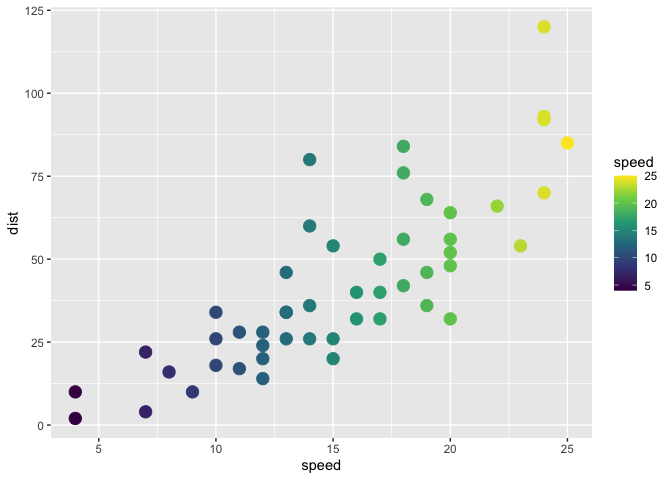

<!-- README.md is generated from README.Rmd. Please edit that file -->

# codeexplode

<!-- badges: start -->
<!-- badges: end -->

The goal of codeexplode is to …

## Installation

And the development version from [GitHub](https://github.com/) with
`devtools::install_github("EvaMaeRey/codeexplode")`

## Example

This is a basic example which shows you how to solve a common problem:

``` r
library(codeexplode)
## basic example code
```

What is special about using `README.Rmd` instead of just `README.md`?
You can include R chunks like so:

``` r
summary(cars) ->
  summary_cars

library(ggplot2) 
cars %>% 
  ggplot() + 
  aes(x = speed, y = dist) + 
  geom_point(size = 4) + 
  aes(color = speed) + 
  scale_color_viridis_c()
```



You can also embed plots, for example:


    #> NULL

In that case, don’t forget to commit and push the resulting figure
files, so they display on GitHub and CRAN.
