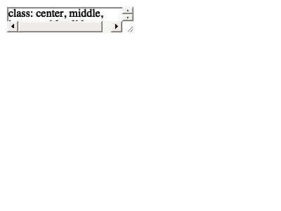

<!-- README.md is generated from README.Rmd. Please edit that file -->

# codeexplode


<!-- badges: start -->
<!-- badges: end -->

flipbooks – go-at-your-own-pace, code and output animations – have up to
this point been *crafted* for education and demonstration purposes.

The flipbook format doesn’t make much sense for getting actual work
done. It is inefficient. We repeat steps (step 1, steps 1-2, steps 1-3)
to create the animation.

However, code that isn’t developed with a flipbook end presentation in
mind might also might be easier to consume in the flipbook format. It
might be transformed into a educational or code-review tool on occasion.

------------------------------------------------------------------------

The goal of codeexplode is to take a .Rmd input (maybe a .R file later),
and convert this to a flipbook product.

This is done by creating a new .Rmd file from a source .Rmd file where

1.  the original yaml is replaced with a flipbook-ready yaml (output to
    xaringan)
2.  flipbookr::chunk\_reveal() is paired with each existing code chunks
    to ‘explode’ them; the original source code chunks are reset to
    include = FALSE.

------------------------------------------------------------------------

Right now, {codeexplode} is not that clever. It work best for auto-type
reveal, where code is written in a sequential way and you would be able
to see outputs as you go. (i.e. right assignment).

------------------------------------------------------------------------

## Installation

And the development version from [GitHub](https://github.com/) with
`devtools::install_github("EvaMaeRey/codeexplode")`

------------------------------------------------------------------------

## Code that plays nice with codeexplode

The following code works well because it is piped, and most pause points
(where parentheses are balanced at the end of a line) will produce an
output

``` r
summary(cars) ->
  summary_cars

library(ggplot2) 
cars %>% 
  ggplot() + 
  aes(x = speed, y = dist) + 
  geom_point(size = 4) + 
  aes(color = speed) + 
  scale_color_viridis_c()
```


------------------------------------------------------------------------

# codeexplode in action

Now let’s also look at what codeexplode does with this .Rmd.

``` r
"README.Rmd" %>% 
codeexplode::rmd_code_explode(
  rmd_output = "docs/readme_exploded.Rmd")
```

I rendered the exploded .Rmd outside this file, because if felt to
mind-bendy to do here. The resultant flipbook (.html) is hosted on
github, and we want to include it.

``` r
"https://evamaerey.github.io/codeexplode/readme_exploded.html" %>% 
knitr::include_url()
```

<a href="https://evamaerey.github.io/codeexplode/readme_exploded.html" target="_blank"></a>
